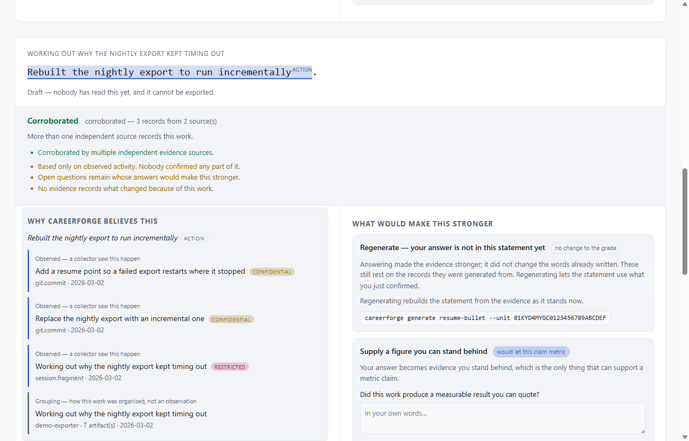
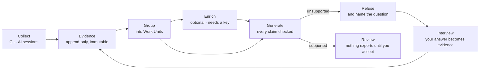

<div align="center">

# CareerForge

### It refuses to invent your accomplishments.

**A local-first evidence engine for professional work.** It collects what you actually did —
your commits, your coding sessions — and generates résumé bullets, STAR stories, and
interview answers where every claim cites the records behind it. Claims the evidence cannot
carry are **removed, not softened**.

[](https://github.com/edwardjgriggs/careerforge/actions/workflows/ci.yml)
[](https://www.npmjs.com/package/careerforge)
[](LICENSE)
[](docs/install.md)
[](docs/adr/0005-ai-is-additive.md)
[](.github/workflows/ci.yml)



_A model proposed four claims about one piece of work. Three of them are gone — not
softened, **gone** — and each one names the question that would change the answer._

</div>

---

## Install

```bash
npm install -g careerforge
careerforge tour
```

Requires **Node.js 22 or newer**. The tour needs no API key, no network, and no account —
it builds its own sample store and never opens yours. Fifteen minutes, and you will know
whether you want this.

```bash
careerforge doctor     # check the install
careerforge tour --reset   # remove the sample store when you are done
```

> The tour is not a recording. Every step calls the same command function the CLI calls, and
> CI walks the whole thing end to end on Linux, macOS, and Windows on every commit. A
> demonstration that cannot fail is a marketing asset, not a demonstration — if the tour
> works, the product works.

**You do not need an AI coding assistant.** Git alone is a complete source — commits,
branches, files touched, co-authors, and when the work actually happened. Coding session
transcripts add the part `git log` throws away, and CareerForge reads them if they are
there, but nothing requires them.

Full instructions, including installing from source: **[docs/install.md](docs/install.md)**.

---

## Why CareerForge exists

Every AI résumé tool has the same problem: it writes confident sentences about work it
cannot see. Ask where _"reduced deployment time by 40%"_ came from and the honest answer is
that a language model produced a plausible number. You then take that number into an
interview and defend it.

The failure is not that the model is bad at writing. It is that **there is no mechanism by
which the output could have been true.** No evidence went in, so no evidence can come out.
Prompting more carefully does not fix a missing input.

CareerForge works the other way around. It collects evidence of work you have already done,
groups it into units of work you would recognise, and generates career assets where **every
claim cites the records behind it**. When the evidence will not carry a stronger claim, it
asks instead of guessing — and your answer becomes evidence too, reusable in everything it
writes afterwards.

**It is not a journaling app.** You should not have to write down what you did. You already
did it, and the record already exists.

---

## What it refuses to do

This is step two of the tour, verbatim. A model was asked for a résumé bullet and proposed
four assertions: what was done, that the person led it, a percentage, and an outcome.

```
Rebuilt the nightly export to run incrementally.

Every part of that, and what stands behind it:

  action   Rebuilt the nightly export to run incrementally
           cites 3 records, from git and from a coding session

Left out — the evidence does not carry them:

  role     "led the redesign of the export pipeline"
           Leadership and responsibility cannot be inferred from activity.
           -> What was your role in this work? Did you lead it?

  metric   "cutting export time by 80%"
           Numbers must be computed from evidence or confirmed by you.
           -> Did this work produce a measurable result you can quote?

  outcome  "eliminating the nightly timeout alerts"
           The evidence records the work, not what came of it.
           -> What actually changed as a result of this work?

Evidence: corroborated — 3 records from 2 source(s)
  Left out for want of evidence: metric, outcome, role.
```

Three of four claims were **removed rather than softened.** There is no code path from a
refused claim to weaker wording, which is how _"led the redesign"_ avoids quietly becoming
_"helped lead the redesign"_.

`role` and `metric` claims — the two that end careers when fabricated — require evidence
you confirmed or evidence that can be computed. Never inference. An `outcome` must be
observed, never inferred from the work that caused it.

**Because it refuses, what it does say survives being asked about.** That is the whole
trade: fewer sentences, each of which you can defend in an interview.

## And what it does say

The refused `role` claim did not vanish — it became a question. Answer it, regenerate, and
the claim comes back **carrying your answer as its support**:

```
Rebuilt the nightly export to run incrementally and led the redesign of the
export pipeline.

  action   Rebuilt the nightly export to run incrementally
           cites 3 records, from git and from a coding session

  role     led the redesign of the export pipeline
           cites your own answer in an interview

Evidence: corroborated — 4 records from 3 source(s)

  + Corroborated by multiple independent evidence sources.
  + Your role is confirmed rather than assumed from activity.
  + Supported by your own answer in an interview.
  - Open questions remain whose answers would make this stronger.
  - No evidence records what changed because of this work.

  Left out for want of evidence: metric, outcome.
```

The percentage is still gone, and it stays gone until something can compute it or you can
quote it. **The grade is part of the output**, not a hidden score — you always know how much
weight a sentence can bear before you put it in front of someone.

---

## Evidence Explorer

`careerforge ui` opens the same thing in a browser. On the left, why CareerForge believes a
statement, labelled by how each record was obtained. On the right, the questions whose
answers would make it stronger — answerable inline, which turns the gap list into the loop
that makes the system smarter with use.



Served from `127.0.0.1` as a constant — no flag, no environment variable, no option
([ADR-0028](docs/adr/0028-listening-is-not-sending.md)). The page fetches nothing from
anywhere: no CDN, no fonts, no framework.

---

## The loop, in four commands

```bash
careerforge collect --backfill    # your Git history and AI coding sessions
careerforge group                 # into units of work you would recognise
careerforge generate resume-bullet --unit <id>
careerforge review <asset-id> --accept
```

Everything above works with no API key except `generate`. When it refuses something,
answer the question it asks instead:

```bash
careerforge interview --unit <id>
careerforge interview --gap <gap-id> --answer "I led it and set the approach."
careerforge generate resume-bullet --unit <id> --force
```

Answering makes your **evidence** stronger. The words already written do not change until
you regenerate — a statement improves when it is rebuilt from the evidence, and not a
moment before.

Before anything leaves your machine:

```bash
careerforge preview --unit <id> --provider openai        # the exact bytes
careerforge consent grant --provider openai --project <key> --level confidential
```

Full walkthrough: **[docs/first-run.md](docs/first-run.md)**.

---

## Core principles

|                                |                                                                                                                                                                                                |
| ------------------------------ | ---------------------------------------------------------------------------------------------------------------------------------------------------------------------------------------------- |
| **Evidence is primary**        | Evidence is what a collector saw. Interpretation is what a model made of it. They live in different tables, and AI output may never occupy an Evidence row.                                    |
| **Provenance is per claim**    | Not per document. Each assertion inside a bullet carries its own support set, and generation refuses to emit one with zero supporting edges.                                                   |
| **Refusal names a remedy**     | `Remedy` is a closed union in the domain, so adding a refusal without deciding what a user could do about it is a compile error ([ADR-0022](docs/adr/0022-every-refusal-names-its-remedy.md)). |
| **Privacy before convenience** | Sensitivity is classified per source _and per project_. Consent is per provider and per project. There is deliberately no global switch.                                                       |
| **Local-first, always**        | No server, no account, no telemetry, no update check. Everything lives in `~/.careerforge`.                                                                                                    |
| **AI is optional**             | Collection, storage, search, timelines, the provenance graph, and export need no key and no network. Enforced by the build graph, not by intention.                                            |
| **Nothing is mutated**         | Append-only. Corrections supersede; deletions tombstone. Your curation is never silently destroyed by an improved algorithm.                                                                   |

---

## Why AI is optional — and how that is enforced

This is not a promise in a README. It is checked on every commit:

- The `domain` package cannot import a provider SDK. It **cannot even see Node's types** —
  `types: []` in the TypeScript config, not a convention.
- Exactly one package, `policy`, may reach the network. Importing an HTTP client or naming
  the global `fetch` anywhere else fails lint, and a boundary test writes deliberately
  illegal code and asserts it is refused.
- A CI job runs the entire suite with `OPENAI_API_KEY`, `ANTHROPIC_API_KEY`, and
  `GOOGLE_API_KEY` set to empty, so _"AI is never required"_ is a test rather than a slogan.

Generating a résumé bullet from a remote model needs a key. Everything else does not:

`tour` · `collect` · `group` · `units` · `explain` · `interview` · `review` · `assets` ·
`consent` · `preview` · `ui` · `search` · `timeline` · `export` · `rebuild` · `reindex` ·
`doctor`

---

## Why privacy is architecture, not a promise

There is no CareerForge server. No account, no telemetry, no sync destination. Your evidence
lives in one directory on your machine and nowhere else.

- **A provider is never handed a payload.** It is handed a _decision_ — the object the
  policy engine produces after evaluating your consent, containing the exact redacted bytes
  it approved. There is no parameter through which a caller could substitute anything else.
- **Nothing leaves without a preview of the exact bytes.** `careerforge preview` shows the
  literal payload, and it shows it **even when the answer is refused** — because seeing what
  would leave is how you decide whether to allow it.
- **Restricted work never leaves by default.** AI coding transcripts are classified
  `restricted`; a `confidential` grant does not cover them.
- **Every evaluation is recorded** — permitted or refused — with a hash of the payload,
  never the payload. Keeping what was sent would make the audit trail the largest
  concentration of sensitive data in your store.

And the honest part: deterministic redaction catches keys, tokens, connection strings, and
private keys. **It does not catch a client's name in a sentence, or an opinion about a
colleague.** That limitation is why the payload preview is mandatory rather than advisory.
See **[docs/privacy.md](docs/privacy.md)**, which names what the design cannot do as plainly
as what it can.

---

## It reads what `git log` throws away

`git log` records what changed and discards _what problem you were solving and why you chose
that approach_ — which is exactly what a STAR story needs and the first thing anyone forgets.
AI coding session transcripts keep it, and CareerForge reads them.

> **Those transcripts expire.** Claude Code deletes them after 30 days by default. The record
> of what you were thinking while you worked is already disappearing, which makes the
> backfill preservation rather than convenience.

---

## Architecture

Dependencies point inward only. The domain layer imports nothing from adapters, performs no
I/O, and has no knowledge that AI exists — which is what makes "AI is never required"
structurally true rather than merely intended.

```
┌──────────────────────────────────────────────────────────┐
│  Interfaces        CLI  ·  Local Web UI                  │
├──────────────────────────────────────────────────────────┤
│  Application       generation · interview · analytics    │
├──────────────────────────────────────────────────────────┤
│  Domain            Evidence · WorkUnit · Provenance      │  ← no I/O, no AI
├──────────────────────────────────────────────────────────┤
│  Ports             CollectorPort · ProviderPort ·        │
│                    ExporterPort · StorePort              │
├──────────────────────────────────────────────────────────┤
│  Adapters          SQLite · JSON export · plugin host ·  │
│                    AI providers · exporters              │
└──────────────────────────────────────────────────────────┘
```

And the pipeline through it:



| Stage        | What happens                                                                                                                          |
| ------------ | ------------------------------------------------------------------------------------------------------------------------------------- |
| **Collect**  | Collectors emit Evidence. Append-only, immutable, factual. They have no store handle — writing is not something to remember to avoid. |
| **Group**    | Artifacts become Work Units — the size at which people describe work. Scored against a hand-labelled corpus, not asserted.            |
| **Enrich**   | Optional. A model interprets, cites its inputs, and never writes Evidence.                                                            |
| **Generate** | Claims are proposed, checked against provenance, and refused or kept.                                                                 |
| **Review**   | Nothing exports until you have read it and accepted it. The gate is in the export path, not in a screen, so scripts inherit it.       |

Storage is SQLite, but the durable copy is a plain JSON export you can read, diff, and grep —
`careerforge rebuild` reconstructs the database from it, and a round-trip test asserts it in
CI. Leaving is always possible, which is the only version of data ownership that means
anything.

Full specification: **[docs/Architecture.md](docs/Architecture.md)**.

---

## Extending it

**A collector is the main extension point,** and the contract is deliberately small:

```ts
export interface CollectorPort {
  readonly manifest: CollectorManifest;
  collect(source: SourceRef, cursor: Cursor | null): AsyncIterable<CollectorEvent>;
}
```

You emit; the host stores, classifies, and applies policy. There is no store handle in the
interface, so a collector structurally cannot write to the database, bypass sensitivity
classification, or skip the policy engine.

Every collector — in-tree or third-party — is held to the same conformance suite, which is
a runner-agnostic test kit you can import without vendoring anything:

```ts
import { describeConformance } from '@careerforge/collect';

describeConformance('my-collector', () => new MyCollector(), { source });
```

Eight checks: idempotence, cursor monotonicity, manifest validity, attribute schema
conformance, tolerance of malformed input, absence of writes, stable natural keys, and
content-hash stability.

**The platform is TypeScript. The ecosystem is language-agnostic.** The plugin protocol is
JSON-RPC 2.0 over stdio ([ADR-0008](docs/adr/0008-jsonrpc-stdio-plugin-protocol.md)), so a
collector can be written in Python, Go, Rust, or anything that speaks it. Plugins declare
capabilities in a manifest — specific paths, specific hosts, scoped evidence access — and
`egress` is a **separate grant from `net`**, because a plugin may need the network to fetch
without being permitted to send your evidence anywhere.

> The out-of-process plugin host is **not built yet.** The seam is in place — `CollectorPort`
> and the `protocol` package — and needs no schema migration to add. See
> [docs/writing-a-collector.md](docs/writing-a-collector.md) for what works today.

---

## Status: 0.2.0, and honest about it

**Working today:** collection from Git and AI coding sessions, grouping into units of work,
generation with every claim checked, the interview, the provenance graph, the egress gate,
Evidence Explorer, and the guided tour. **953 tests, on three operating systems, on every
commit.**

**Not built yet:** out-of-process plugins, sync, analytics, a desktop shell, providers other
than OpenAI, exporters other than Markdown. Each has a seam already in place and needs no
schema migration to add.

**`@careerforge/protocol` is unstable** and will change without a major version bump until
1.0. Everything else follows semver from 0.2.0. At 1.0 the Evidence schema and the plugin
protocol freeze — **1.0 is a compatibility promise, not a feature count.**

This section will always tell you the truth about what works.

---

## Roadmap

Sequencing is driven by what people actually hit, not by this list. In expected order of
pressure:

|                     |                                                                                                                                                                                                                                                                                                                                                                                                                  |
| ------------------- | ---------------------------------------------------------------------------------------------------------------------------------------------------------------------------------------------------------------------------------------------------------------------------------------------------------------------------------------------------------------------------------------------------------------- |
| **More collectors** | The v1 audience is broader than developers. A detection engineer's best work is a tuned rule that prevented an incident; a sysadmin's is a migration nobody noticed. At least one collector must capture **outcome-shaped** rather than activity-shaped evidence. This is [open question #4](docs/Vision.md#15-open-questions--deferred-to-architecture) and the most important unsolved problem in the project. |
| **More providers**  | Anthropic, Ollama, LM Studio. Local models are a first-class path, not a degraded one — sensitive sources should default to them.                                                                                                                                                                                                                                                                                |
| **More exporters**  | PDF, DOCX, JSON Resume. `ExporterPort` exists.                                                                                                                                                                                                                                                                                                                                                                   |
| **Plugin runtime**  | The out-of-process host and capability enforcement. Turns the protocol from a design into an ecosystem.                                                                                                                                                                                                                                                                                                          |
| **Redaction v2**    | Whether a **local-model** pre-screen is worth the complexity for the class patterns cannot detect. It cannot be a remote call — that would defeat the purpose.                                                                                                                                                                                                                                                   |
| **Sync**            | User-owned destinations only: Git, a private repo, Syncthing, S3, a NAS. Encrypted before it leaves; keys belong to you. There will never be a CareerForge-hosted store of user evidence.                                                                                                                                                                                                                        |
| **Analytics**       | Which technologies am I actually using? Which skills have gone dormant? Built from evidence, never from manual tracking.                                                                                                                                                                                                                                                                                         |

How the thirteen shipped milestones were sequenced, and the acceptance criteria each had to
meet: [docs/IMPLEMENTATION_PLAN.md](docs/IMPLEMENTATION_PLAN.md).

---

## Documentation

|                                                    |                                                       |
| -------------------------------------------------- | ----------------------------------------------------- |
| [Installing](docs/install.md)                      | Requirements, verification, where files live          |
| [First run](docs/first-run.md)                     | The tour, then your own work                          |
| [FAQ](docs/faq.md)                                 | Cost, scale, Windows, what happens to your data       |
| [The privacy model](docs/privacy.md)               | What happens to your data, and which code enforces it |
| [Writing a collector](docs/writing-a-collector.md) | The main extension point                              |
| [Architecture](docs/Architecture.md)               | How it works, ordered by permanence                   |
| [Vision](docs/Vision.md)                           | What it is, who it serves, what it refuses to do      |
| [Architecture decisions](docs/adr/)                | 30 ADRs, each with what would overturn it             |
| [Implementation plan](docs/IMPLEMENTATION_PLAN.md) | How the shipped milestones were sequenced             |
| [Measurements](docs/PreArchitecture-Findings.md)   | The numbers that shaped the design                    |
| [Grouping benchmark](eval/grouping/)               | Hand-labelled corpus and the score, committed         |

---

## Contributing

```bash
git clone https://github.com/edwardjgriggs/careerforge
cd careerforge
npm install
npm run verify        # format, lint, build, typecheck, test — everything CI runs
```

No API key is required to build, test, or contribute, and that is deliberate.

**A contributor should not need to understand the whole codebase to write a collector** — if
you do, that is a bug in our API and we want to hear about it.

Every major decision has an ADR with a **"Revisit if"** section, because a decision without
stated falsification conditions is a belief. **If one of them looks wrong to you, saying so
is a contribution** — a decision that cannot survive scrutiny should not survive.

Start here: **[CONTRIBUTING.md](CONTRIBUTING.md)** · [good first issues](https://github.com/edwardjgriggs/careerforge/labels/good%20first%20issue) · [help wanted](https://github.com/edwardjgriggs/careerforge/labels/help%20wanted)

Security issues: **[SECURITY.md](SECURITY.md)**, never the issue tracker.

---

## License

[Apache 2.0](LICENSE). The name is protected by [trademark policy](TRADEMARK.md) rather than
by restricting the software — build on it freely, just do not claim to be us.
